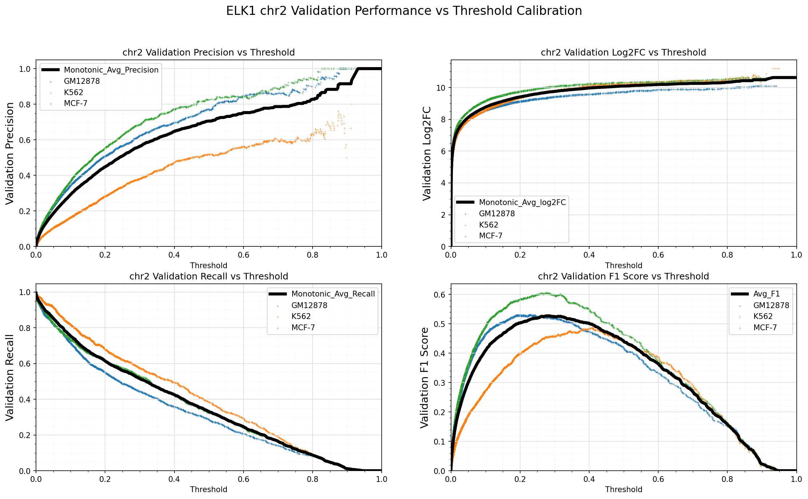

# maxATAC Data

This repo contains the data in relation to the maxATAC project. For complete installation directions of maxATAC please refer to the maxATAC repo, https://github.com/MiraldiLab/maxATAC
## `./hg38`

This directory contains:

1. `hg38_maxatac_blacklist.bed`: bed file of maxATAC blacklist regions
2. `hg38_maxatac_blacklist.bw`: bed file of maxATAC blacklist regions
3. `hg38.chrom.sizes`: hg38 chromosome sizes file

Curation of the maxATAC black list is described in the [maxATAC preprint](https://www.biorxiv.org/content/10.1101/2022.01.28.478235v1.article-metrics)

## `./models`

Information for the 127 TF models available through maxATAC. Each directory is a TF name. Each directory contains a `.h5` of the best TF model, a `.tsv` file of threshold statistics, and a `.png` of the statistics.

Example directory structure:

```pre
|____ATF2
| |____ATF2_validationPerformance_vs_thresholdCalibration.png
| |____ATF2_binary_revcomp99_fullModel_RR0_73.h5
| |____ATF2_validationPerformance_vs_thresholdCalibration.tsv
```

By default, the threshold for calling TFBS is set to maximize the validation F1-score of the TF model. The threshold statistics file and image enables users to see the trade-offs between precision and recall for each model, information that could guide their parameter choices for [`maxatac predict`](https://github.com/MiraldiLab/maxATAC/blob/main/docs/readme/predict.md#Predict)

### Example threshold statistics file

This is an example of the first 6 lines of the threshold statistics file used to call peaks. The first column is the threshold. Every column after is the average performance reported for different metrics on validation chromosome 2.

```pre
Standard_Thresh	Monotonic_Avg_Precision	Monotonic_Avg_Recall	Monotonic_Avg_log2FC	Avg_F1
0.0	0.0035793736711456103	0.9910269020975186	0.4617435633366975	0.0071224011910284366
0.001	0.018103716393149	0.9242690259191988	2.996816276717381	0.03517534734171995
0.002	0.027523721672056148	0.92192080328679	3.5979115724538913	0.05275399945034204
0.003	0.03384312047545328	0.9123870842533509	3.8788363137406194	0.06429293366464785
0.004	0.03872007478681639	0.9030209327592842	4.055800482157333	0.07305708818396862
0.005	0.04270041191717275	0.9017292649083462	4.199724330597559	0.0801251221410759
```

### Example threshold statistics image



## `./scripts`

A directory of scripts that are used to process the ATAC-seq, DHS, and ChIP-seq data analyzed by our publication. The scripts `ATAC_bowtie2_pipeline.sh` and `scatac_generate_bigwig.sh` are required for running `maxatac prepare`.

```pre
.
|____ATAC
| |____align_reads_STAR.sh
| |____infer_insertion_sites.sh
| |____ATAC_bowtie2_nodedup_pipeline.sh
| |____RPM_normalize_Tn5_counts.sh
| |____shift_reads.sh
| |____trim_reads.sh
| |____infer_Tn5_sites.sh
| |____scatac_generate_bigwig.sh
| |____ATAC_bowtie2_pipeline.sh
| |____sra2fastq_PE.sh
| |____filter_BAM_STAR.sh
| |____ATAC_post_alignment.sf
|____DHS
| |____infer_DHS_cut_sites.sh
| |____generate_DHS_coverage_bigwig.sh
| |____filter_DHS_SE_ENCODE.sh
|____CHIP
| |____infer_5prime_BAM.sh
| |____filter_chroms_from_bam.sh
| |____slop_5prime.sh
| |____RPM_normalize_5prime_counts.sh
```

## `Example_TF_META.tsv`

This `.tsv` file shows an example meta file required to train your own models. 

## Publication

The maxATAC pre-print is currently available on [bioRxiv](https://www.biorxiv.org/content/10.1101/2022.01.28.478235v1.article-metrics). 

```pre
maxATAC: genome-scale transcription-factor binding prediction from ATAC-seq with deep neural networks
Tareian Cazares, Faiz W. Rizvi, Balaji Iyer, Xiaoting Chen, Michael Kotliar, Joseph A. Wayman, Anthony Bejjani, Omer Donmez, Benjamin Wronowski, Sreeja Parameswaran, Leah C. Kottyan, Artem Barski, Matthew T. Weirauch, VB Surya Prasath, Emily R. Miraldi
bioRxiv 2022.01.28.478235; doi: https://doi.org/10.1101/2022.01.28.478235
```
